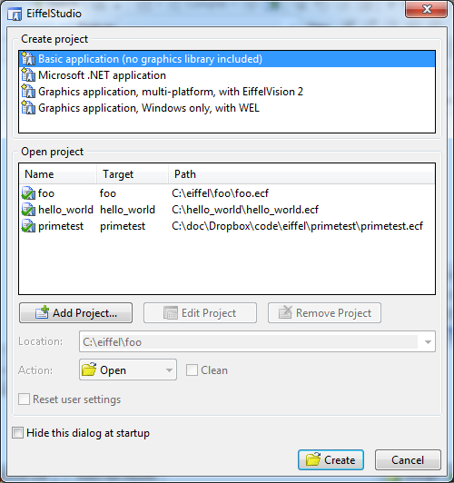

In which we install Eiffel Studio and look closely at the Hello World example.

## Installing Eiffel Studio 7.3 ##
Go and grab [Eiffel Studio 7.3](https://www2.eiffel.com/download/download_info.aspx?id=eiffelstudio&info=false&mirrors=eiffelstudio) (requires a free account, but at the time of writing, your friends at [bugmenot](http://www.bugmenot.com) have got you covered).

Installation on Windows is straightforward. If you wanna install it on mac, be warned - nobody in our class, instructors included, could get it to run on OS X in a stable manner. It works just fine on a virtual machine though.

After installing, you should be able to start Eiffel Studio and get a screen looking somewhat like this one:

## Hello World ##
Go ahead and create a new Basic Application, this should generate a new project for you, with the following _APPLICATION_ class (Eiffel classnames are all uppercase)

	note
		description : "foo application root class"
		date        : "$Date$"
		revision    : "$Revision$"

	class
		APPLICATION

	inherit
		ARGUMENTS

	create
		make

	feature {NONE} -- Initialization

		make
				-- Run application.
			do
				--| Add your code here
				print ("Hello Eiffel World!%N")
			end

	end

Now click the Run icon, and watch the output window pop open. So far so good!

Taking a quick look at the _APPLICATION_ class, let's see what we can divine.

The note part in the beginning seems to be optional, there might be built-in tools that will parse the key-value pairs up there, but I don't know any.

The classname is preceded by the keyword _class_.

Our class inherits from the class _ARGUMENTS_

The _create_ keyword tells which of the class members that are constructors - in our case _make_.

The feature {NONE} part looks scary, let us not tackle that just yet. But inside it, is our constructor _make_, along with some friendly comments.

Method bodies are enclosed in a _do_ _end_ pair, and the _make_ method here simply prints a string to standard output.

Finally the _end_ marks the end of the APPLICATION class. Doesn't look too bad.

Random thoughts from playing with Hello World:

-  _%_ is the character escape sequence
- single line comments start with two dashes: _- -_
- Eiffel does not care about whitespace. Linebreaks and tab indents are purely cosmetic (think Java or C#).

Next up: Flow control and more syntax!